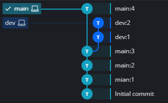
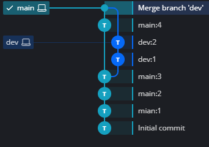

# 分支的简介和基本操作
分支是 Git 最核心、最强大的功能之一，是实现多人协作、功能并行开发的基础。

## 一、分支的简介
分支可以看作代码库中的**独立版本线**，拥有独立的提交记录，互不干扰。形象地说，分支就像一棵树的枝干，每个枝干都有自己的生长轨迹。

### 分支的核心作用
- 适合**团队协作**：多个开发者在各自分支开发，互不影响
- 功能隔离：新建分支开发新功能、修复BUG，不破坏主线代码
- 保证主分支稳定：主线（main/master）始终保持可运行、稳定的状态
- 高效管理项目：开发、测试、修复并行进行

## 二、分支的基本操作
### 初始化仓库
创建演示文件夹，初始化 Git 仓库：
```bash
mkdir branch-demo
cd branch-demo
git init
```

### 演示规范
为了清晰展示分支变化，统一命名规则：
- 文件命名：`分支名+序号`，如 `main1.txt`、`dev1.txt`
- 提交信息：`分支名:序号`，如 `main:1`、`dev:1`

### 1. 主分支（main）初始化提交
在默认主分支创建文件并提交：
```bash
# 第一次提交
echo main1 > main1.txt
git add .
git commit -m "main:1"

# 第二次提交
echo main2 > main2.txt
git add .
git commit -m "main:2"

# 第三次提交
echo main3 > main3.txt
git add .
git commit -m "main:3"
```

### 2. 查看分支
```bash
git branch
```
- 输出中带 `*` 的分支 = **当前所在分支**
- 新建仓库默认只有 `main` 分支

### 3. 创建分支
```bash
# 创建 dev 分支
git branch dev
```
**注意：`git branch` 仅创建分支，不会自动切换**

### 4. 切换分支
Git 提供两种切换分支的命令：
```bash
# 传统命令（兼容所有版本）
git checkout dev

# 现代专用命令（Git 2.23+ 推荐，无歧义）
git switch dev
```

#### 补充说明
`git checkout` 功能较多（可恢复文件+切换分支），若文件名与分支名重名会产生歧义；`git checkout`命令会默认切换分支，而不是恢复文件。
`git switch` 是**专用切换分支命令**，更安全、更直观。

### 5. 分支开发（dev 分支操作）
切换到 dev 分支后，创建专属文件并提交：
```bash
echo dev1 > dev1.txt
git add .
git commit -m "dev:1"

echo dev2 > dev2.txt
git add .
git commit -m "dev:2"
```

### 6. 分支隔离验证
切回 main 分支，查看文件：
```bash
git switch main
ls
```
输出结果：
```bash
README.md  main1.txt  main2.txt  main3.txt
```
dev 分支的修改**不会影响 main 分支**，分支完全隔离。

### 7. 主分支继续开发
在 main 分支新增提交，让两个分支产生分叉：
```bash
echo main4 > main4.txt
git add .
git commit -m "main:4" 
```
在Gitkraken分支图上可以看到，git分支和dev分支已经合并了。


### 8. 合并分支
将 `dev` 分支的代码**合并到当前所在的 main 分支**：
```bash
# 格式：git merge <要合并的分支名>
git merge dev
```
在Gitkraken分支图上可以看到，git分支和dev分支已经合并了。


### 9. 查看分支合并图
#### 命令行查看（无需GUI工具）
```bash
git log --graph --oneline --decorate --all
```
执行结果：
```bash
*   ab7c558 (HEAD -> main) Merge branch 'dev'
|\
| * 66fc012 (dev) dev:2
| * 0157081 dev:1
* | ccd9354 main:4
|/
* 0905f21 main:3
* f5f9fde main:2
* 564dd84 main:1
* 9dd85b0 Initial commit
```

### 10. 删除分支
分支合并完成后，可删除无用分支：
```bash
# 安全删除（仅删除已合并的分支，推荐）
git branch -d <分支名>

# 强制删除（删除未合并的分支，慎用）
git branch -D <分支名>
```

---

## 三、核心命令速查
| 命令 | 作用 |
| :--- | :--- |
| `git branch` | 查看所有分支 |
| `git branch 分支名` | 创建分支 |
| `git switch 分支名` | 切换分支（推荐） |
| `git merge 分支名` | 合并分支到当前分支 |
| `git branch -d 分支名` | 删除已合并分支 |
| `git branch -D 分支名` | 强制删除分支 |
| `git log --graph --oneline --all` | 图形化查看分支历史 |
