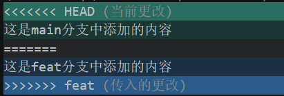

# 解决合并冲突
分支合并是Git协作开发的常用操作，当分支修改无重叠时Git可自动合并；若**不同分支修改了同一文件的同一位置**，则会触发合并冲突，必须手动解决后才能完成合并。

## 一、冲突产生的原因
- 两个分支**修改内容无重合**：Git 自动完成合并，无需人工干预
- 两个分支**修改同一文件的同一位置**：Git 无法判断保留哪部分内容，触发**合并冲突**，需手动解决

## 二、实际操作
使用上一节的分支演示仓库，复现冲突并完成解决全流程。

### 1. 新建功能分支 feat
```bash
git branch feat
```

#### 常见分支命名规范
- `main/master`：主分支，项目稳定版本，所有分支基于此创建
- `dev`：开发分支，汇总功能开发内容
- `feat`：功能分支，开发新功能，最终合并到`dev`
- `bugfix`：缺陷修复分支，修复开发中的bug
- `release`：发布分支，用于版本发布，合并到`main`
- `hotfix`：紧急修复分支，修复线上主分支紧急问题
- `support`：兼容支持分支，维护旧版本

### 2. 切换到 feat 分支并修改文件
```bash
git switch feat
```
编辑`main1.txt`，添加一行：
```
这是feat分支中添加的内容
```
> 具体添加方式可通过vim编辑器，也可以通过记事本添加。
提交修改（`-a` 参数可**跳过git add，直接提交已跟踪文件的修改**）：
```bash
git commit -a -m "feat:1"
```

### 3. 切回 main 分支并验证文件隔离
```bash
git switch main
cat main1.txt
```
执行结果：
```bash
$ cat main1.txt
▒▒main1
```
切换分支后，Git 会自动恢复工作区文件为当前分支的内容，feat分支的修改不会影响main分支。

### 4. 在 main 分支修改同一文件并提交
编辑`main1.txt`，添加一行：
```
这是main分支中添加的内容
```
提交修改：
```bash
git commit -am "main:6"
```

### 5. 合并分支，触发冲突
将`feat`分支合并到当前`main`分支：
```bash
git merge feat
```
会看到输出以下内容，提示合并冲突。自动合并失败，需要解决冲突后再提交。
```bash
$ git merge feat
warning: Cannot merge binary files: main1.txt (HEAD vs. feat)
Auto-merging main1.txt
CONFLICT (content): Merge conflict in main1.txt
Automatic merge failed; fix conflicts and then commit the result.
```

### 6. 查看冲突信息
#### 查看冲突文件列表
```bash
git status
```
输出结果：
```bash
$ git status
On branch main
You have unmerged paths.
  (fix conflicts and run "git commit")
  (use "git merge --abort" to abort the merge)

Unmerged paths:
  (use "git add <file>..." to mark resolution)
        both modified:   main1.txt

no changes added to commit (use "git add" and/or "git commit -a")
```

#### 查看冲突具体内容
```bash
git diff
```
输出结果：
```bash
$ git diff
diff --cc main1.txt
index c759502,849af09..0000000
--- a/main1.txt
+++ b/main1.txt
@@@ -1,2 -1,2 +1,6 @@@
  main1
++<<<<<<< HEAD
 +这是main分支中添加的内容
++=======
+ 这是feat分支中添加的内容
++>>>>>>> feat
```

### 7. 冲突标记说明
Git 会用固定符号标记冲突区域：
- `<<<<<<< HEAD`：当前所在分支（main）的内容
- `=======`：分隔线，上下为两个分支的修改
- `>>>>>>> feat`：待合并分支（feat）的内容



冲突文件原始内容：
```txt
main1
<<<<<<< HEAD
这是main分支中添加的内容
=======
这是feat分支中添加的内容
>>>>>>> feat
```

### 8. 手动解决冲突
打开`main1.txt`，**删除所有冲突标记**，保留需要的最终内容，例如：
```txt
main1
这是main分支中添加的内容
这是feat分支中添加的内容
```

### 9. 提交合并结果
```bash
git commit -am "merge conflict"
```

### 10. 放弃合并（可选）
若想终止合并、恢复到合并前状态，执行：
```bash
git merge --abort
```

---

## 三、核心命令速查
| 命令 | 作用 |
| :--- | :--- |
| `git branch 分支名` | 创建新分支 |
| `git switch 分支名` | 切换分支 |
| `git commit -a -m "信息"` | 跳过暂存，直接提交已跟踪文件修改 |
| `git merge 分支名` | 合并指定分支到当前分支 |
| `git status` | 查看冲突文件列表 |
| `git diff` | 查看冲突具体内容 |
| `git commit -am "信息"` | 解决冲突后提交合并结果 |
| `git merge --abort` | 放弃合并，恢复到合并前状态 |