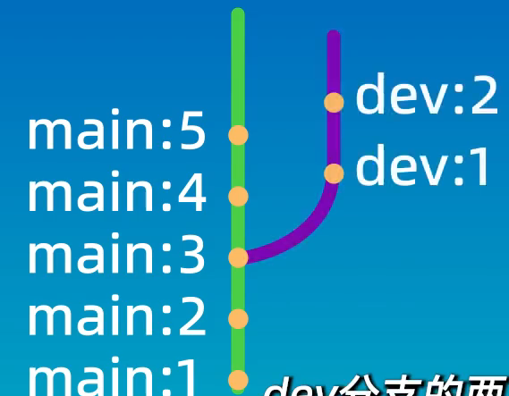
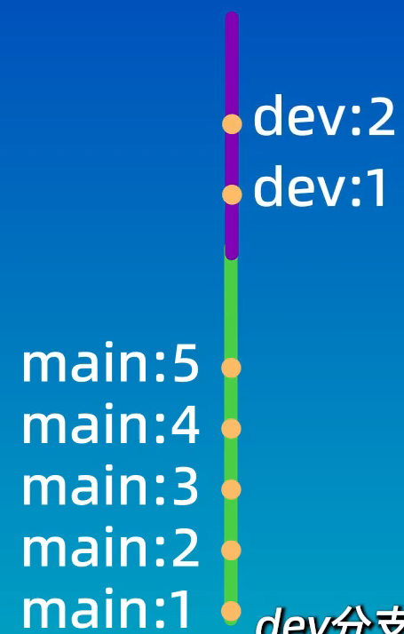
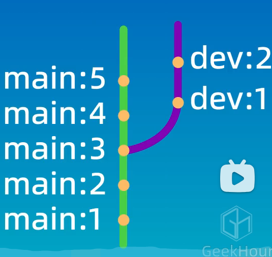
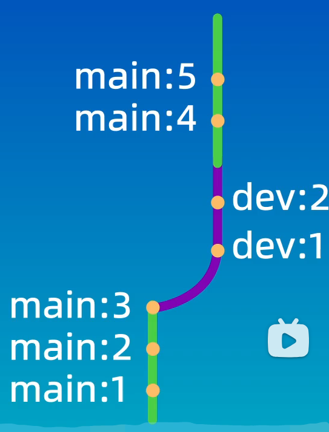
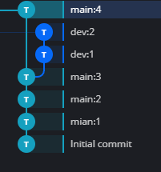
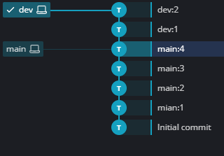
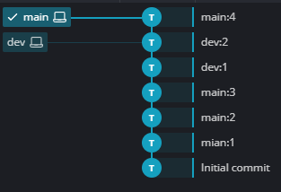

# 回退和 rebase
之前在使用合并操作的时候，是先使用checkout或者switch命令来切换到main分支，然后执行git merge dev 命令就可以将dev分支合并到main分支上。合并完成之后的结果就是main分支上会多出一个提交记录，然后两个分支就像两条溪流一样汇聚到了一起，我们是在main分支上执行的合并操作（合并到当前所在的分支）。

除了 `merge` 之外，Git 还提供了 `rebase`（变基）命令，用于整合不同分支的修改内容，是日常开发中管理提交历史的重要方式。

## 一、rebase 简介
`merge` 合并分支的常规操作：
切换到主分支，执行合并命令，将其他分支合并到当前分支，合并后会新增一条合并提交，分支历史呈现汇聚形态。

```bash
git switch main
git merge dev
```

`rebase` 可以在任意分支上执行，作用是将当前分支的所有提交，“嫁接”到目标分支的最新提交之后，最终让提交历史变成一条干净的直线。

```bash
# 将 dev 分支变基到 main 分支
git switch dev
git rebase main
```

 -> 

```bash
# 将 main 分支变基到 dev 分支
git switch main
git rebase dev
```

 -> 

## 二、rebase 核心原理
Git 中每个分支都有指针指向最新提交。
执行 `rebase` 时：
1. Git 先找到当前分支与目标分支的**共同祖先**
2. 将当前分支上，从共同祖先到最新提交的所有提交记录
3. 移动并追加到目标分支的最新提交后面

整个过程类似于**树枝嫁接**，把分叉的分支整条移动到目标分支末端，最终形成线性提交历史。

## 三、实际操作
进入之前使用的 `branch-demo` 仓库，先将仓库恢复到执行 merge 之前的状态。

### 1. 清理与恢复分支
删除之前演示冲突用的 `feat` 分支：
```bash
git branch -d feat
```

恢复之前删除的 `dev` 分支（指定到 `dev:2` 对应的提交ID）：
```bash
git checkout -b dev <dev:2 提交ID>
```

### 2. 回退 main 分支
切换回 main 分支，使用 `reset` 回退到合并前的 `main:4` 提交：
```bash
git switch main
git reset --hard <main:4 提交ID>
```

此时仓库已恢复到合并操作之前的状态：


### 3. 复制仓库用于对比演示
为了分别演示两种变基效果，将仓库复制两份：
```bash
cp -rf branch-demo rebase1
cp -rf branch-demo rebase2
```

### 4. 演示 dev 变基到 main
进入 `rebase1` 目录，执行变基：
```bash
git switch dev
git rebase main
```


### 5. 演示 main 变基到 dev
进入对应目录，执行变基：
```bash
git switch main
git rebase dev
```


## 四、rebase 和 merge 的区别与使用选择
### merge
- 优点：不会破坏原有分支的提交历史，方便回溯和查看
- 缺点：会产生额外的合并提交节点，分支图相对复杂

### rebase
- 优点：不会新增额外提交，形成线性历史，整洁直观
- 缺点：会修改提交历史与分支分叉节点，**严禁在共享分支上使用**

---

## 五、核心命令速查
| 命令 | 作用 |
| :--- | :--- |
| `git rebase 目标分支` | 将当前分支变基到目标分支末端 |
| `git branch -d 分支名` | 删除已合并的分支 |
| `git checkout -b 分支名 提交ID` | 基于指定提交恢复/新建分支 |
| `git reset --hard 提交ID` | 强制回退到指定历史版本 |